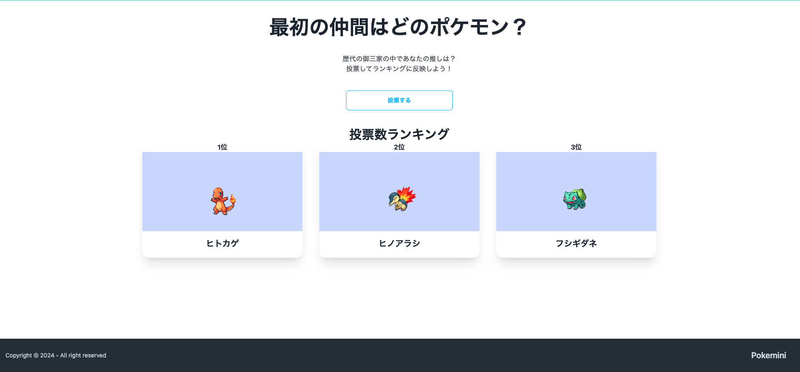

# 作成したアプリまとめ
## 作成したアプリのまとめです。
[PantryChefNotifier(- 食材管理とレシピ提示アプリ -)](https://pantry-chef-notifier.com) | [リポジトリ](https://github.com/ryo-mogura/Pantry-Chef-Notifier)
-- | --
 | **概要**   食材の管理を簡単にできるサービスです。 消費・賞味期限が近い食材と、その食材を使用したレシピをLINEかメールで通知してくれます。 LINE上から食材の登録・削除, 登録されている食材リストの取得などの機能が簡単に操作できます
### ミニアプリ
[ポケモン御三家どの子が好き？(Pokemini)](https://pokemini-app.onrender.com)| --
-- | --
 | --
-- | --
ポケモンで一番好きな御三家を投票してランキング表示するサービス。 開発期間：2日
-- | --
[リポジトリ](https://github.com/ryo-mogura/pokemini_app) | --
